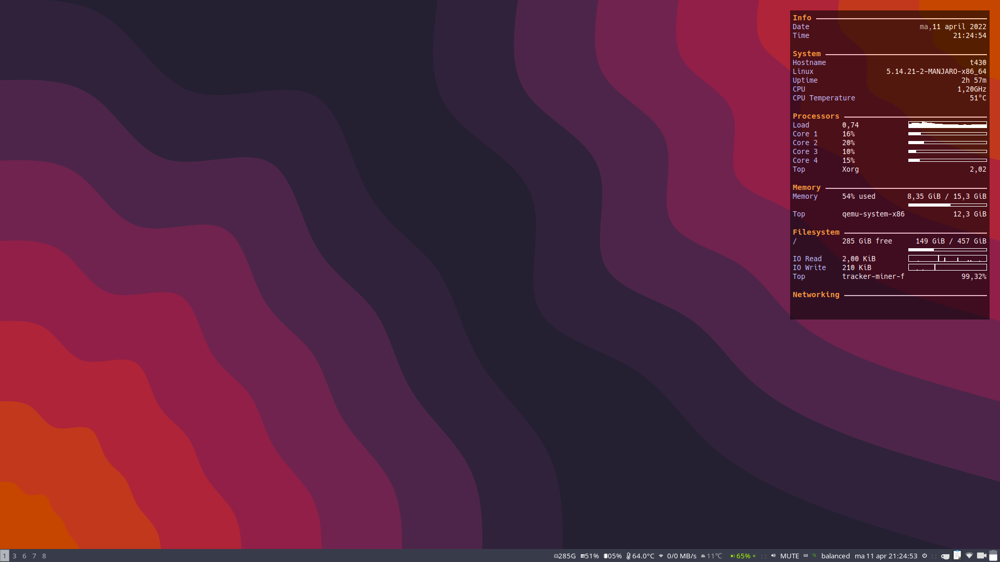

# `i3-gaps` and `gnome-i3` config ![Author](https://img.shields.io/badge/guru-michaeltrip-3399cc.svg?logo=data:image/svg+xml;base64,PD94bWwgdmVyc2lvbj0iMS4wIiBlbmNvZGluZz0iVVRGLTgiPz4KPHN2ZyB2ZXJzaW9uPSIxLjEiIHZpZXdCb3g9IjAgMCAzMiAzMiIgeG1sbnM9Imh0dHA6Ly93d3cudzMub3JnLzIwMDAvc3ZnIj4KPGRlZnM+CjxjbGlwUGF0aCBpZD0iYSI+CjxwYXRoIGQ9Im0wIDI0NS41aDM4OC44NnYtMjQ1LjVoLTM4OC44NnoiLz4KPC9jbGlwUGF0aD4KPC9kZWZzPgo8ZyB0cmFuc2Zvcm09Im1hdHJpeCguMTgxMzcgMCAwIC0uMTgxMzcgLTE4LjYzMyAzOC41OTkpIiBjbGlwLXBhdGg9InVybCgjYSkiPgo8ZyB0cmFuc2Zvcm09InRyYW5zbGF0ZSgxOTEuMjkgNDAuODcyKSI+CjxwYXRoIGQ9Im0wIDBjNDUuODU1IDAgODMuMTYyIDM3LjMwNiA4My4xNjIgODMuMTYyIDAgNDUuODU1LTM3LjMwNyA4My4xNjItODMuMTYyIDgzLjE2Mi00NS44NTQgMC04My4xNjItMzcuMzA3LTgzLjE2Mi04My4xNjIgMC00NS44NTYgMzcuMzA4LTgzLjE2MiA4My4xNjItODMuMTYyIiBmaWxsPSIjZmZmIi8+CjwvZz4KPGcgdHJhbnNmb3JtPSJ0cmFuc2xhdGUoMjAyLjI2IDEwMi40KSI+CjxwYXRoIGQ9Im0wIDAtMjguMDIzIDUyLjc4NmMxLjQxNC0yLjg0IDEuNTAyLTYuMjg4LTAuMDk5LTkuMzAzbC05LjAwMi0xNi45NiAxOS4xNDYtMzYuMDY4YzEuODMtMy40NDMgNS4zNTQtNS40MDYgOC45OTktNS40MDYgMS42MDkgMCAzLjI0MSAwLjM4NCA0Ljc2MyAxLjE5MSA0Ljk2MyAyLjYzNSA2Ljg1MSA4Ljc5NCA0LjIxNiAxMy43NiIgZmlsbD0iIzllYzllZCIvPgo8L2c+CjxnIHRyYW5zZm9ybT0idHJhbnNsYXRlKDE2MC4zNyAxNTkuNikiPgo8cGF0aCBkPSJtMCAwYzQuOTY4IDIuNjM1IDExLjEyNiAwLjc0NyAxMy43Ni00LjIxNmwwLjEwNS0wLjJjLTAuOTEzIDEuODM2LTIuMzY2IDMuNDIyLTQuMzE1IDQuNDU3LTQuOTYgMi42MzUtMTEuMTI0IDAuNzQ4LTEzLjc1OS00LjIxN2wtMjguMTI3LTUyLjk4NGMtMi42MzctNC45NjUtMC43NDgtMTEuMTI0IDQuMjE2LTEzLjc1OSAxLjUyLTAuODA5IDMuMTUzLTEuMTkxIDQuNzYzLTEuMTkxIDMuNjQ0IDAgNy4xNjkgMS45NjMgOC45OTggNS40MDZsMTkuMTIzIDM2LjAyNi04Ljk4MSAxNi45MTdjLTIuNjM2IDQuOTY0LTAuNzQ3IDExLjEyNiA0LjIxNyAxMy43NjEiIGZpbGw9IiMzMTk5Y2MiLz4KPC9nPgo8ZyB0cmFuc2Zvcm09InRyYW5zbGF0ZSgxNzQuMjMgMTU1LjE5KSI+CjxwYXRoIGQ9Im0wIDAtMC4xMDUgMC4xOTljLTIuNjM1IDQuOTYzLTguNzkzIDYuODUxLTEzLjc2MSA0LjIxNi00Ljk2NC0yLjYzNS02Ljg1Mi04Ljc5Ni00LjIxNy0xMy43Nmw4Ljk4MS0xNi45MTggOS4wMDIgMTYuOTZjMS42MDIgMy4wMTUgMS41MTMgNi40NjMgMC4xIDkuMzAzIiBmaWxsPSIjM2M2M2FkIi8+CjwvZz4KPGcgdHJhbnNmb3JtPSJ0cmFuc2xhdGUoMjQ1LjYzIDE2MC44MykiPgo8cGF0aCBkPSJtMCAwaC0xOS42ODljNS42MjEgMCAxMC4xNzctNC41NTYgMTAuMTc3LTEwLjE3N3YtMTAuMTc3aDkuNTEyYzUuNjIxIDAgMTAuMTc4IDQuNTU2IDEwLjE3OCAxMC4xNzdzLTQuNTU3IDEwLjE3Ny0xMC4xNzggMTAuMTc3IiBmaWxsPSIjMzE5OWNjIi8+CjwvZz4KPGcgdHJhbnNmb3JtPSJ0cmFuc2xhdGUoMjI1Ljk0IDE2MC44MykiPgo8cGF0aCBkPSJtMCAwaC0xOS42ODdjLTUuNjIxIDAtMTAuMTc2LTQuNTU2LTEwLjE3Ni0xMC4xNzdzNC41NTUtMTAuMTc3IDEwLjE3Ni0xMC4xNzdoOS41MTF2MTAuMTc3YzAgNS42MjEgNC41NTYgMTAuMTc3IDEwLjE3NiAxMC4xNzciIGZpbGw9IiMzMTk5Y2MiLz4KPC9nPgo8ZyB0cmFuc2Zvcm09InRyYW5zbGF0ZSgyMTUuNzYgOTcuMzY5KSI+CjxwYXRoIGQ9Im0wIDBjMC01LjYyMSA0LjU1Ni0xMC4xNzcgMTAuMTc3LTEwLjE3N3MxMC4xNzcgNC41NTYgMTAuMTc3IDEwLjE3N3Y0My4xMTFoLTIwLjM1NHoiIGZpbGw9IiMzMTk5Y2MiLz4KPC9nPgo8ZyB0cmFuc2Zvcm09InRyYW5zbGF0ZSgyMjUuOTQgMTYwLjgzKSI+CjxwYXRoIGQ9Im0wIDBjLTUuNjIgMC0xMC4xNzYtNC41NTYtMTAuMTc2LTEwLjE3N3YtMTAuMTc3aDIwLjM1NHYxMC4xNzdjMCA1LjYyMS00LjU1NyAxMC4xNzctMTAuMTc4IDEwLjE3NyIgZmlsbD0iIzNjNjNhZCIvPgo8L2c+CjwvZz4KPC9zdmc+Cg==)    | 

Some of the programs /binaries / scripts already reside the `.config/i3/scripts` folder.

You have to install these packages below.

## packages

- pavucontrol
- dmenui
- rofi
- pavucontrol
- pcmanfm
- chromium (freeworld)
- picom
- nitrogen
- scrot
- dunst
- nm-applet
- xautolock
- xfce4-power-manager
- clipit
- blueman-applet
- i3bar
- i3status
- redshift
- redshift-gtk
- geoclue
- light
- caffeine
- i3blocks
- ranger
- ueberzug
- [gnome-i3](https://github.com/i3-gnome/i3-gnome)
- gnome-flasback

## How to use this:use

### `.config` folder

Copy the contents of the `.config`  folder to your `$HOME/.config`

### systemd

Systemd scripts allow machine to sleep when lid is closed. A service is started that locks the screen after going out of suspend. Copy this to `/etc/systemd`

### xorg.conf.d snippets

these scripts are specific for the use of a trackball. You can place them in the `/etc/X11/xorg.conf.d` folder.

### The results

Check this nice screenshot:

